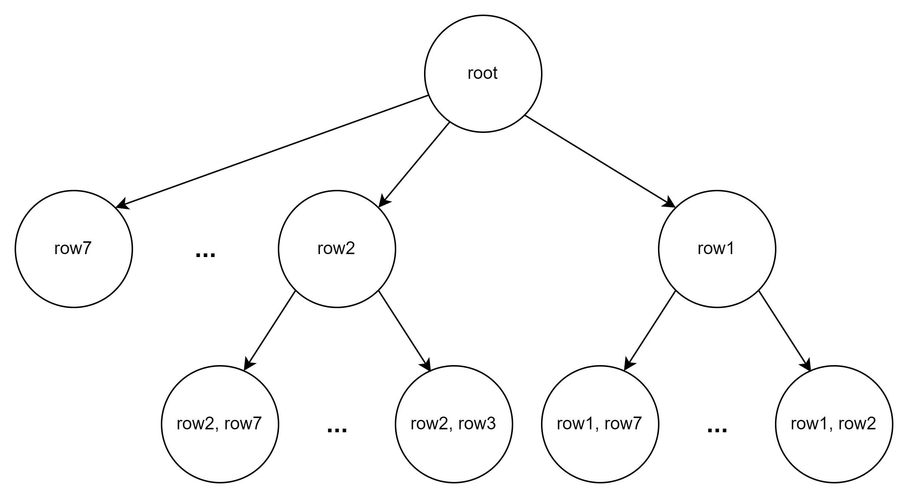

# Quine-McCluskey
## Environment
GCC: 4.9.2  
## Introduction
Two-level logic optimizer based on the Quine-McCluskey method.  
The main objective is to find the minimum cover of the given function.  
It is accomplished in two steps:
1. Find all prime implicants of the function.  
2. Find the sum-of-products expression of the function with the minimum number of prime implicants.
## Method
### Step 1:
The Quine-McCluskey method can be found in [here](https://www.geeksforgeeks.org/quine-mccluskey-method/ "link").  
### Step 2:
Create a table based on the prime implicants obtained from step 1.  
- For example  

|  | 0 | 1 | 2 | 9 | 12 | 20 | 21 | 22 | 23 | 24 | 25 | 29 | 30 |
| :--- | :---: | :---: | :---: | :---: | :---: | :---: | :---: | :---: | :---: | :---: | :---: | :---: | :---: |
| 0000- | x | x |   |   |   |   |   |   |   |   |   |   |   |
| 000-0 | x |   | x |   |   |   |   |   |   |   |   |   |   |
| -1100 |   |   |   |   | x |   |   |   |   |   |   |   |   |
| --001 |   | x |   | x |   |   |   |   |   |   | x |   |   |
| 11-0- |   |   |   |   |   |   |   |   |   | x | x | x |   |
| 1---1 |   |   |   |   |   |   | x |   | x |   | x | x |   |
| 1-1-- |   |   |   |   |   | x | x | x | x |   |   | x | x |  

Find the combination of rows (prime implicants) that can mark 'x' on all columns (on-set elements) with the minimum number of rows.  
- Algorithm  
Generate a general tree and increase the number of rows as depth increases.  
Perform BFS while generating the tree.  
Once the combination that can mark 'x' on all columns is found, stop generating next depth.  
<p align="left">
  
</p>

## Input/Output
### Input format:
'i' indicates the number of variables.  
'm' indicates the on-set.  
'd' indicates the don't care set.  
  ```
  .i
  5
  .m
  0 1 2 9 12 20 21 22 23 24 25 29 30
  .d
  17 19 27 28 31
  ```
### Output format:
'p' indicates the number of prime implicants.  
'mc' indicates the minimum cover.  
'literal' indicates the number of elements in the minimum cover.  
  ```
  .p 7
  ABD'
  AC
  AE
  A'B'C'D'
  A'B'C'E'
  BCD'E'
  C'D'E

  .mc 5
  ABD'
  AC
  A'B'C'E'
  BCD'E'
  C'D'E
  literal=16
  ```
## How to use
  ```
  make
  main.o input.txt output.txt 
  ```
